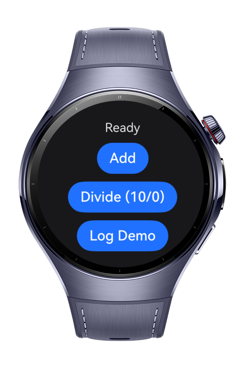
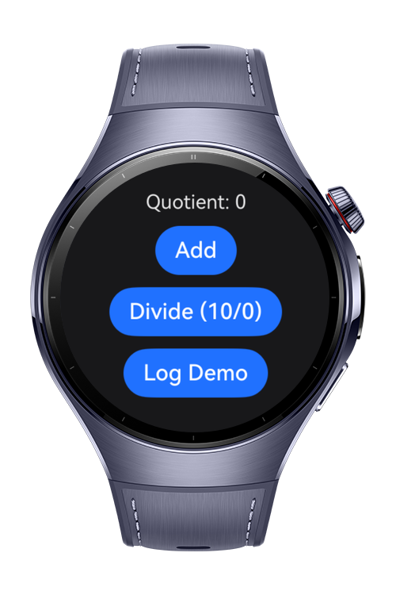
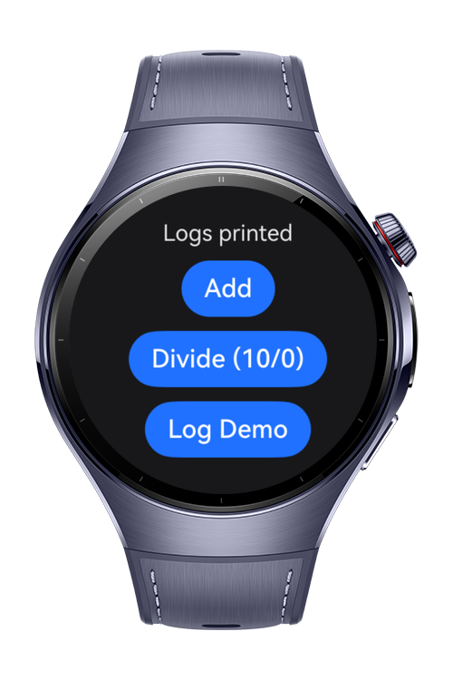

> **Note:** To access all shared projects, get information about environment setup, and view other guides, please visit [Explore-In-HMOS-Wearable Index](https://github.com/Explore-In-HMOS-Wearable/hmos-index).

# How to Implement Logging in C

This application (NativeHiLog) is a sample project on the wearable ecosystem that demonstrates how to implement logging in C++ for HarmonyOS using the HiLog library, and how to call these native functions from ArkTS.

# Preview
<div>




</div>

# Use Cases

* Integrate the HiLog library (`libhilog_ndk.z.so`) into a C++ module via CMakeLists.txt.
* Configure log domain (`LOG_DOMAIN`) and tag (`LOG_TAG`) in C++.
* Log with `OH_LOG_DEBUG`, `OH_LOG_INFO`, `OH_LOG_WARN` and `OH_LOG_ERROR`.
* Log with a custom tag using `OH_LOG_Print`.
* Check whether a log level is enabled using `OH_LOG_IsLoggable`.
* Automatically add file name and line number to each log line with short macros (`LOGD`, `LOGI`, `LOGW`, `LOGE`).
* Control log privacy with `{public}` and `{private}` format specifiers.
* Log error scenarios (e.g. division by zero) from native code.
* Call native C++ functions from ArkTS via Node-API and log on both sides with the same domain.

# Tech Stack

* Languages: ArkTS, C++
* Libraries: @kit.PerformanceAnalysisKit, libhilog_ndk.z.so, libace_napi.z.so

# Directory Structure

```
└── main
    └── cpp
        ├── CMakeLists.txt
        ├── napi_init.cpp
        └── include
            ├── logger.h
        └── types
            └── libentry
                ├── Index.d.ts
                ├── oh-package.json5
    └── ets
        └── entryability
            ├── EntryAbility.ets
        └── pages
            ├── Index.ets
```

# Constraints and Restrictions

### Supported Devices

* Huawei Watch 5
* Huawei Watch Ultimate 2

# LICENSE

**How to Implement Logging in C** is distributed under the terms of the MIT License. See the [LICENSE](LICENSE) for more information.
